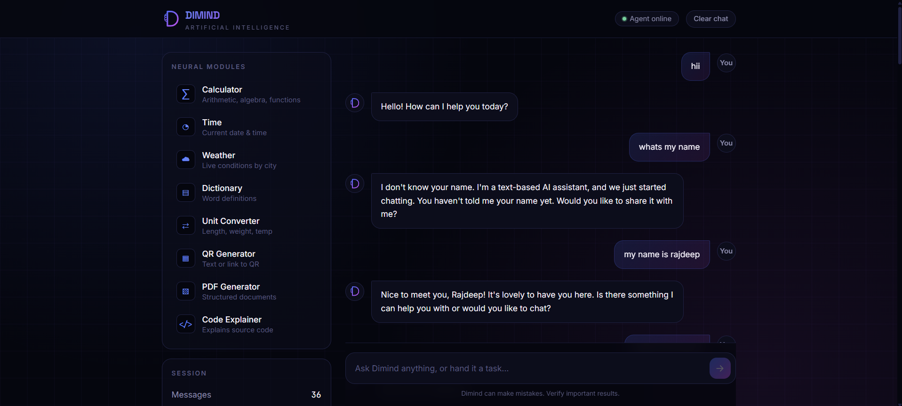
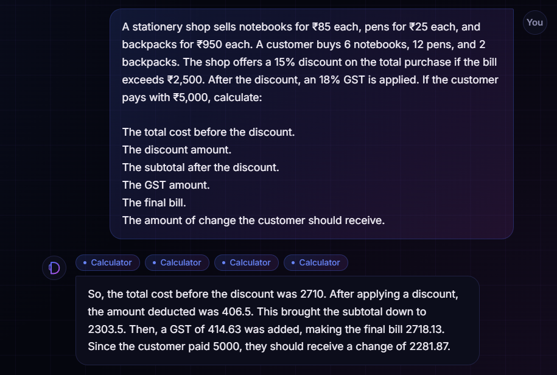
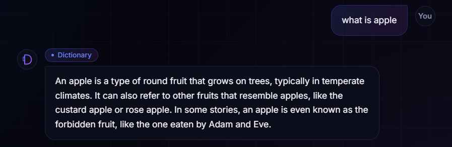
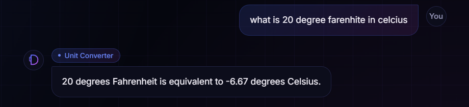
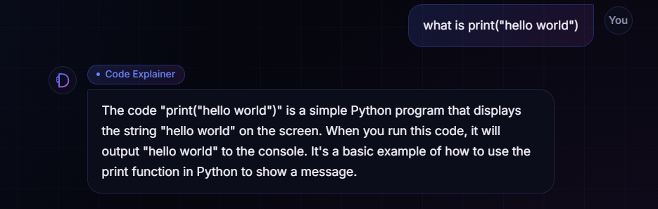
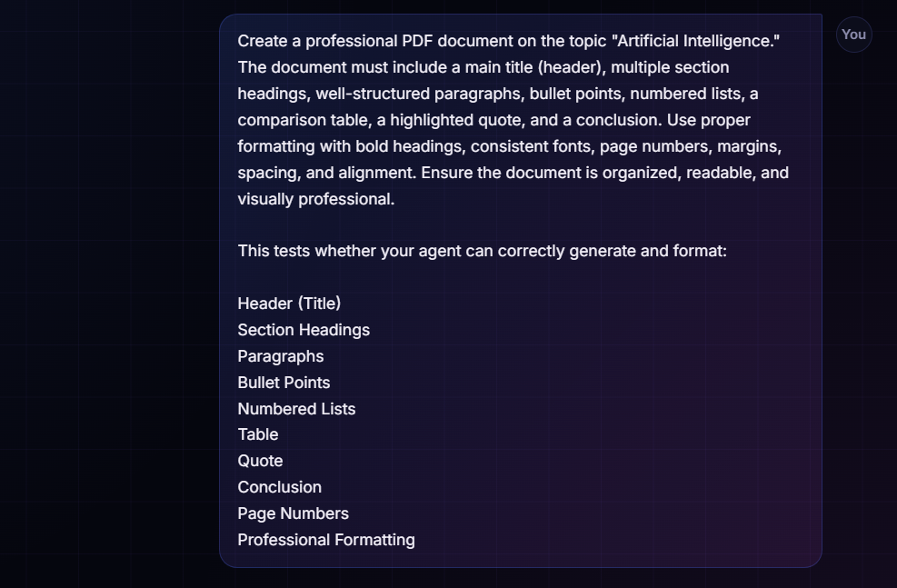
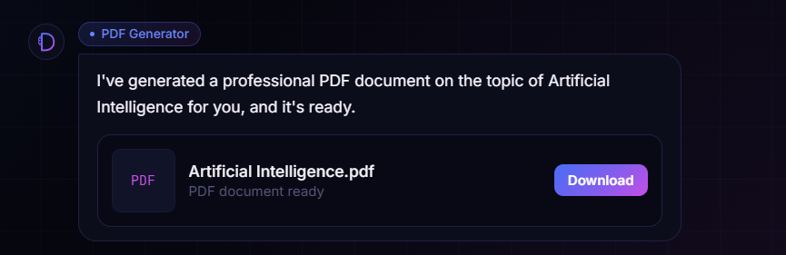
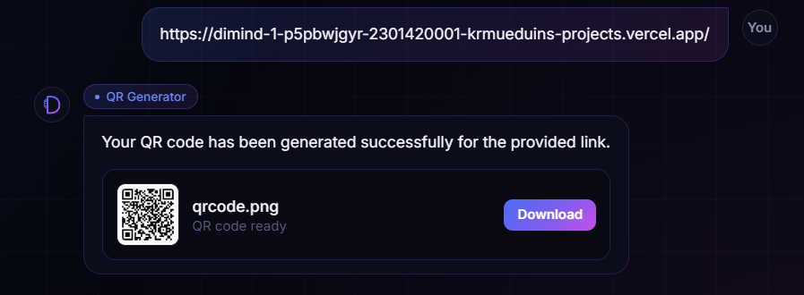

<div align="center">

# 🧠 Dimind AI

### *Think Less. Build More.*

An intelligent **Agentic AI Assistant** that automatically understands your request, chooses the right tool, and responds naturally—without exposing internal tool calls.

<p align="center">
  <a href="https://dimind-1.vercel.app/">
    
  </a>
  <a href="https://github.com/YOUR_USERNAME/YOUR_REPOSITORY">
    
  </a>
  
  
  
</p>

### 🌐 Live Application

## **https://dimind-1.vercel.app/**

</div>

---

# ✨ About

Dimind AI is a modern **Agentic AI Assistant** designed to provide a seamless conversational experience.

Instead of making users choose between different tools, Dimind intelligently analyzes every request, automatically selects the appropriate tool, executes it in the background, and returns a clean, human-like response.

No technical jargon.
No tool names.
Just intelligent conversations.

---

# 🚀 Features

✅ Natural AI Conversations

✅ Automatic Tool Selection

✅ PDF Generation

✅ QR Code Generator

✅ Calculator

✅ Live Weather

✅ Dictionary

✅ Unit Converter

✅ Code Explanation

✅ Downloadable Files

✅ Chat History

✅ Fast & Responsive UI

✅ Modern Design

---

# 🛠️ Tech Stack

| Category | Technologies |
|-----------|-------------|
| Frontend | Next.js, React, TypeScript |
| Styling | Tailwind CSS |
| AI | Groq API, Llama Models |
| Backend | Next.js API Routes |
| PDF | pdf-lib |
| Weather | Open-Meteo API |
| Dictionary | Free Dictionary API |
| QR Code | QR Server API |

---

# ⚙️ How It Works

```text
User Query
      │
      ▼
 AI Understands Intent
      │
      ▼
 Selects Appropriate Tool
      │
      ▼
 Executes Tool
      │
      ▼
 Generates Natural Response
      │
      ▼
Returns Final Answer
```

---

# 📦 Available Tools

| Tool | Description |
|------|-------------|
| 🧮 Calculator | Perform mathematical calculations |
| 🌤 Weather | Get real-time weather information |
| 📖 Dictionary | Find meanings, synonyms & definitions |
| 📏 Unit Converter | Convert measurement units |
| 📄 PDF Generator | Generate downloadable PDFs |
| 📱 QR Generator | Generate QR Codes instantly |
| 💻 Code Explainer | Explain programming code |

---

# 📁 Project Structure

```
app/
│
├── api/
│   └── chat/
│
├── components/
│
├── lib/
│   ├── tools/
│   │
│   ├── calculator.ts
│   ├── dictionary.ts
│   ├── weather.ts
│   ├── pdf.ts
│   ├── qr.ts
│   ├── unit.ts
│   └── codeExplain.ts
│
└── public/
```

---

# 🚀 Getting Started

## Clone Repository

```bash
git clone https://github.com/YOUR_USERNAME/YOUR_REPOSITORY.git
```

## Navigate

```bash
cd YOUR_REPOSITORY
```

## Install Dependencies

```bash
npm install
```

## Configure Environment

Create a `.env.local`

```env
GROQ_API_KEY=YOUR_API_KEY
MODEL_NAME=llama-3.3-70b-versatile
```

## Run

```bash
npm run dev
```

Visit

```
http://localhost:3000
```

---

# 🌐 Deployment

The application is deployed on **Vercel**.

### Live Demo

## 👉 https://dimind-1.vercel.app/

---

# 📸 Screenshots

> Add your application screenshots here.

```
assets/

home.png

chat.png

pdf.png

weather.png

calculator.png
```

---

# 💡 Why Dimind?

Unlike traditional AI assistants that expose tool calls and backend operations, Dimind focuses entirely on the user experience.

✔ Clean Responses

✔ Automatic Intelligence

✔ Modern UI

✔ Fast Performance

✔ Easy to Extend

✔ Agentic Workflow

---

# 🔮 Upcoming Features

- 🎙 Voice Assistant
- 🖼 Image Generation
- 📂 File Upload
- 📑 Document Chat
- 🎤 Speech to Text
- 🔊 Text to Speech
- 🧠 Long-Term Memory
- 🌍 Multi-language Support
- 🔐 Authentication
- ☁ Cloud Sync

---

# 🤝 Contributing

Contributions are always welcome.

```bash
Fork 🍴

Create Branch 🌿

Commit Changes ✅

Push 🚀

Open Pull Request 🎉
```

---

# ⭐ Support

If you like this project,

please consider giving it a ⭐ on GitHub.

It really helps!

---

# 👨‍💻 Developer

## Rajdeep Sutradhar

**B.Tech CSE (Data Science)**

AI • Machine Learning • Agentic AI • Full Stack Development

---

<div align="center">

### ⭐ Built with ❤️ by Rajdeep Sutradhar

### 🌐 Live Demo

## https://dimind-1.vercel.app/

**Happy Coding! 🚀**

</div>

# 📸 Project Gallery

## 🏠 Home Interface

<p align="center">
  
</p>

---

## 🧮 Calculator Tool

<p align="center">
  
</p>

---

## ⏰ Time & 🌤 Weather Tool

<p align="center">
  
</p>

---

## 📖 Dictionary Tool

<p align="center">
  
</p>

---

## 📏 Unit Converter

<p align="center">
  
</p>

---

## 💻 Code Explainer

<p align="center">
  
</p>

---

## 📄 PDF Generator

### PDF Generation Request

<p align="center">
  
</p>

### Generated PDF

<p align="center">
  
</p>

---

## 📱 QR Code Generator

<p align="center">
  
</p>

---
